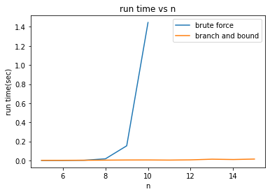

# traveling-salesman-problem
Solve traveling salesman problem (TSP) using branch and bound or brute force.

* 

* Set use_input_txt = 1 if you want to use input from file, or set use_input_txt = 0 to auto generate input data.
* Upload input.txt to current directory at the "Files" bar on the left 
* Click "Runtime" and "Run all" and see the output file BF.txt and BB.txt in current directory

